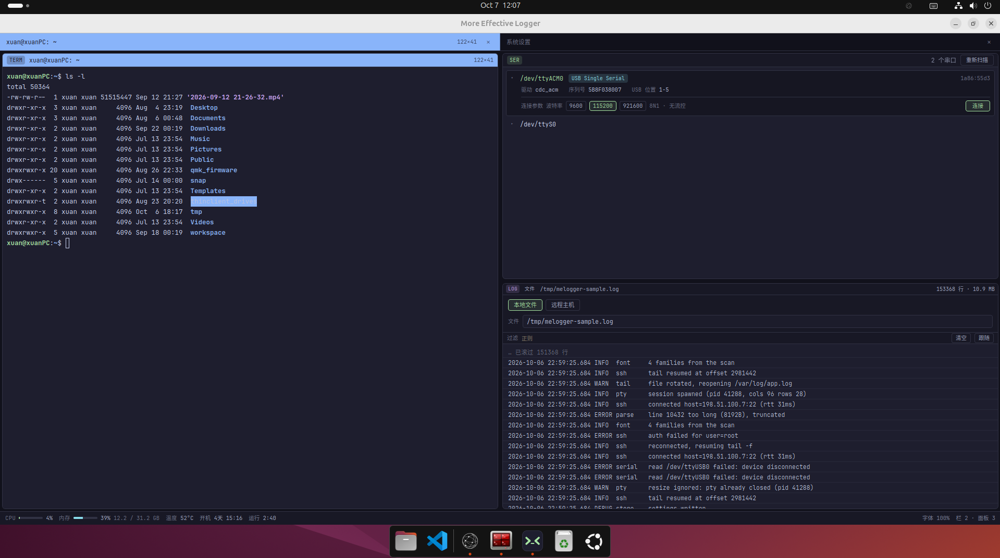

# more-effective-logger

致力于打造更好用的终端&日志查看工具。

致敬 C++ 的经典书籍，《More Effective xx》 系列。



---

## 技术栈

| 层 | 技术 |
|---|------|
| 桌面壳体 | Tauri v2 (Rust) |
| 前端 | Vite 6 + React 19 + TypeScript 5 + TailwindCSS v4 |


## 目录结构

```
├── index.html                  # Vite 入口
├── src/                        # React 前端
│   ├── main.tsx                # React 挂载
│   ├── App.tsx                 # 页面骨架：页 / 面板树 / 菜单 / 状态栏 / 设置页
│   ├── theme.ts                # Catppuccin 调色板：界面 token + 终端主题
│   ├── log.ts                  # 前端日志：攒批送给后端写文件
│   ├── index.css               # Tailwind v4 入口 + @theme token
│   ├── components/             # 终端 / 日志 / 串口 / 设置 / 顶栏 / 状态栏 / 菜单
│   └── layout/                 # 布局树与几何计算
├── src-tauri/                  # Rust 后端
│   ├── src/
│   │   ├── main.rs             # 入口（仅调用 app_lib::run）
│   │   ├── lib.rs              # Builder 装配：挂载 AppState + 注册命令
│   │   ├── state.rs            # 全局 AppState（pty / 串口会话表）
│   │   ├── commands.rs         # IPC 命令层
│   │   └── modules/            # 子模块：pty / serial / sysstat / fonts / store / logfile / logger
│   ├── icons/                  # 应用图标
│   └── tauri.conf.json
├── assets/                     # 界面截图 + 图标源文件
├── scripts/                    # 打包辅助脚本
├── tests/                      # 日志样例数据源
├── Dockerfile.release          # 发版构建镜像（Ubuntu 22.04）
├── release.sh                  # 发版脚本
├── LICENSE                     # GPL-3.0-only
└── docs/                       # 设计文档
```

---

本项目采用 GPL-3.0-only 许可，全文见 [`LICENSE`](LICENSE)。

---